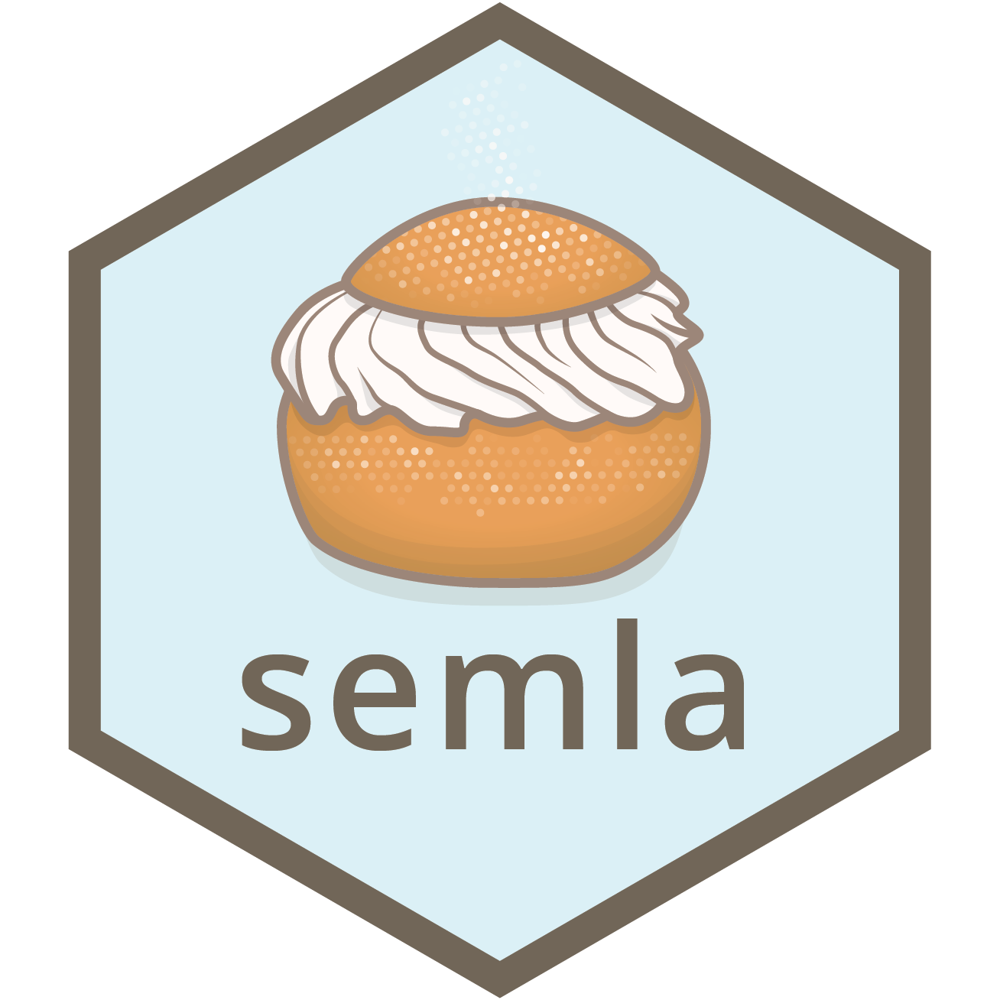

# semla 

<!-- badges: start -->

[](https://github.com/ludvigla/semla) [](https://github.com/ludvigla/semla/commits/main) [](https://opensource.org/license/mit/)
[](https://zenodo.org/badge/latestdoi/599058747)

<!-- badges: end -->

<br>

`semla` is an R package that collects useful tools for Spatially Resolved Transcriptomics data analysis and visualization.

If you are visiting our Github page, please find more information at our package [website](https://ludvigla.github.io/semla/)

Here you can find documentation of functions together with examples on how to use them, as well as tutorials showing how to use `semla` for analysis of 10x Visium data.

## Installation

The dev version of the package can be installed through GitHub using;

````
install.packages("remotes")
remotes::install_github("ludvigla/semla")
````


## Setting up a conda environment

If you want to run `semla` within a conda environment, you first need to ensure to have anaconda installed. We suggest using [miniconda](https://docs.conda.io/en/latest/miniconda.html)

    conda create -n r-semla r-essentials r-base

Now activate the environment

    conda activate r-semla
    
There's one R package that might cause a few issues if not configured properly, namely `magick`. I suggest installing it with conda within the environment:

    conda install -c conda-forge r-magick

Then you can open RStudio from the environment. This should make sure that RStudio uses the R version and packages that are located in the conda environment. On Mac OS, you can open RStudio by typing something like the following in the terminal:

    /Applications/RStudio.app/Contents/MacOS/RStudio

`semla` requires R v4.1 or higher, so you should double check that you have the correct version installed.

Now you should be able to install `semla` in your conda environment:

````
install.packages("remotes")
remotes::install_github("ludvigla/semla")
````


# Renv

If you are familiar with [renv](https://rstudio.github.io/renv/articles/renv.html), you can install all necessary R packages (with exact versions) using `renv::restore()` with the `renv.lock` file provided in our GitHub repo. 

## What is semla?

A semla is a delicious pastry, traditionally consumed around a specific day, "Semmeldagen" or "Fettisdagen" ("Fat Tuesday"), in Sweden. It is made up of a light cardamom flavored wheat bun, fluffy whipped cream, sweet crunchy almond paste, and topped with dusted icing sugar. If that's not reason enough for us to name this package after this fantastic creation, let's also say *semla* is an abbreviation for "**S**patially r**E**solved transcripto**M**ics too**L**s for **A**nalysis".

<br>
