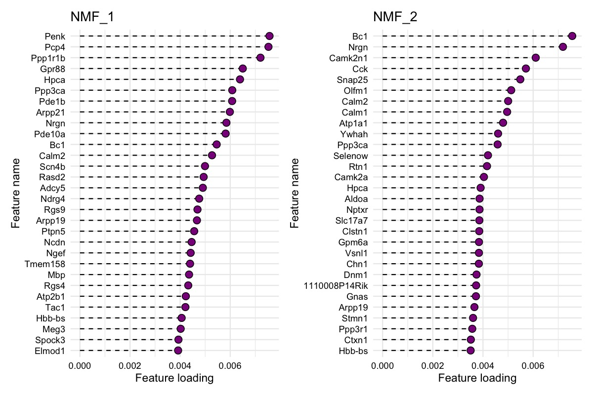

Non-negative matrix factorization (NNMF or NMF) can be a useful technique to deconvolve 10x Visium data, in particular when a reference single-cell RNA-seq data is not available to conduct cell type deconvolution. In this vignette we will demonstrate how you can apply this method with `semla` on spatial data.

We recommend using the [singlet](https://zdebruine.github.io/singlet/) R package for NNMF which handles `Seurat` objects. `singlet` uses the ultra fast NNMF implementation from [RcppML](https://zdebruine.github.io/RcppML/). Both of these packages are developed by Zach DeBruines lab and you can find more information about their work and tools at <https://github.com/zdebruine> and <https://www.zachdebruine.com/>.

`RcppML` is available on [CRAN](https://cran.r-project.org/web/packages/RcppML/index.html) and [GitHub](https://github.com/zdebruine/RcppML), and singlet can be installed from GitHub with `devtools::install_github("zdebruine/singlet")`.

```{r include=FALSE, eval=TRUE}
if (packageVersion("RcppML") == "0.3.7") {
  devtools::install_github("zdebruine/RcppML")
  devtools::install_github("zdebruine/singlet", ref="8ab019d")
}
```

```{r message=FALSE, warning=FALSE}
library(semla)
library(singlet)
library(SeuratData)
```

<br>

## Run NMF

We'll use a mouse brain Visium data set provided in `SeuratData` for the NNMF. The method automatically runs cross-validation to find the best rank and learns a model at that rank.

The factorization can be computed on all genes, but below we have filtered the data to include only the top variable features to speed up the computation.

```{r eval=FALSE}
# Here we'll use an example data set provided in SeuratData
se_mbrain <- LoadData("stxBrain", type = "anterior1")

# Update se_mbrain for compatibility with semla
se_mbrain <- UpdateSeuratForSemla(se_mbrain)

# Normalize data and find top variable features
se_mbrain <- se_mbrain |> 
  NormalizeData() |> 
  FindVariableFeatures()

# OPTIONAL: subset data to improve computational speed
se_mbrain <- se_mbrain[VariableFeatures(se_mbrain), ]

# Set seed for reproducibility
set.seed(42)
se_mbrain <- RunNMF(se_mbrain)
```

```{r eval=FALSE}
k <- ncol(se_mbrain@reductions$nmf@feature.loadings)
```

We can plot the cross-validation results and find that the optimal rank decided by the method is 22, which determines the number of factors we obtain from the NMF run.

```{r fig.asp=0.5, eval=FALSE}
RankPlot(se_mbrain)
```

```{r eval=FALSE, include=FALSE}
jpeg("NNMF/rank_plot.jpg", width = 1.2e3, height = 6e2, res = 150)
RankPlot(se_mbrain)
dev.off()
```


<br>

### Spatial visualization

The results are stored as a `DimReduc` object in our `Seurat` object and we can map the factors spatially with `MapFeatures()`.

```{r fig.asp=1.2, fig.width=9, eval=FALSE}
MapFeatures(se_mbrain, 
            features = paste0("NMF_", 1:22), 
            override_plot_dims = TRUE, 
            colors = viridis::magma(n = 11, direction = -1)) &
  theme(plot.title = element_blank())
```

```{r eval=FALSE, include=FALSE}
jpeg("NNMF/spatial_plot.jpg", width = 2e3, height = 3e3, res = 150)
MapFeatures(se_mbrain, 
            features = paste0("NMF_", 1:22), 
            override_plot_dims = TRUE, 
            colors = viridis::magma(n = 11, direction = -1)) &
  theme(plot.title = element_blank())
dev.off()
```


<br>

### Explore gene contributions

We can also investigate the gene loadings for each factor with `PlotFeatureLoadings()` which will give us an idea about what the top contributing genes for each factor are. Below we can see the top 30 contributing genes for NMF_1 and NMF_2.

```{r eval=FALSE}
PlotFeatureLoadings(se_mbrain, 
                    dims = 1:2, 
                    reduction = "nmf", 
                    nfeatures = 30,
                    mode = "dotplot", 
                    fill = "darkmagenta",
                    pt_size = 3)
```

```{r eval=FALSE, include=FALSE}
jpeg("NNMF/gene_loadings.jpg", width = 1.2e3, height = 8e2, res = 150)
PlotFeatureLoadings(se_mbrain, 
                    dims = 1:2, 
                    reduction = "nmf", 
                    nfeatures = 30,
                    mode = "dotplot", 
                    fill = "darkmagenta",
                    pt_size = 3)
dev.off()
```



<br>

### Make composite plot

We can also map multiple factors spatially in a single plot with `MapMultipleFeatures()`. Note that the visualization will only display the most dominant factor for each spot. See `?MapMultipleFeatures()` for details.

```{r eval=FALSE}
se_mbrain <- LoadImages(se_mbrain)

factor_colors <- c('#e6194b', '#3cb44b', '#ffe119', '#4363d8', '#f58231', 
                   '#911eb4', '#46f0f0', '#f032e6', '#bcf60c', '#fabebe', 
                   '#008080', '#e6beff', '#9a6324', '#fffac8', '#800000', '#aaffc3')

# Select non-overlapping factors
selected_factors <- c(1, 2, 3, 4, 5, 6, 7, 9, 10, 12, 13, 15, 16, 17, 19, 20)

MapMultipleFeatures(se_mbrain, 
                    features = paste0("NMF_", selected_factors), 
                    colors = factor_colors, 
                    image_use = "raw", 
                    override_plot_dims = TRUE, 
                    pt_size = 2)
```

```{r eval=FALSE, include=FALSE}
jpeg("NNMF/multiple_factors.jpg", width = 1.4e3, height = 1e3, res = 150)
MapMultipleFeatures(se_mbrain, 
                    features = paste0("NMF_", selected_factors), 
                    colors = factor_colors, 
                    image_use = "raw", 
                    override_plot_dims = TRUE, 
                    pt_size = 3)
dev.off()
```


<br>

### Explore gene contributions (heatmap)

Similarly, we can also summarize the top feature loadings for each factor with a heatmap:

```{r fig.asp=1.4, eval=FALSE}
PlotFeatureLoadings(se_mbrain, 
                    dims = selected_factors, 
                    reduction = "nmf", 
                    nfeatures = 30, 
                    mode = "heatmap", 
                    gradient_colors = viridis::magma(n = 11, direction = -1))
```

```{r eval=FALSE, include=FALSE}
jpeg("NNMF/multiple_factors_heatmap.jpg", width = 1.4e3, height = 2e3, res = 150)
PlotFeatureLoadings(se_mbrain, 
                    dims = selected_factors, 
                    reduction = "nmf", 
                    nfeatures = 30, 
                    mode = "heatmap", 
                    gradient_colors = viridis::magma(n = 11, direction = -1))
dev.off()
```


## Functional Enrichment Analysis (FEA)

If you want to get the feature loading values for each factor, you can extract them from the `DimReduc` object. This can for example be useful to run Functional Enrichment Analysis (FEA).

```{r eval=FALSE}
# fetch feature.loadings from DimReduc object
nmf_loadings <- se_mbrain[["nmf"]]@feature.loadings

# Convert to long format and group data by factor
gene_loadings_sorted <- nmf_loadings |> 
  as.data.frame() |> 
  tibble::rownames_to_column(var = "gene") |> 
  as_tibble() |> 
  tidyr::pivot_longer(all_of(colnames(nmf_loadings)), names_to = "fctr", values_to = "loading") |> 
  mutate(fctr = factor(fctr, colnames(nmf_loadings))) |> 
  group_by(fctr) |> 
  arrange(fctr, -loading)

# Extract top 10 genes per factor
gene_loadings_sorted |> 
  slice_head(n = 10)
```

```{r eval=FALSE, include=FALSE}
saveRDS(gene_loadings_sorted, file = "NNMF/gene_loadings_sorted")
```

```{r echo=FALSE}
gene_loadings_sorted <- readRDS("NNMF/gene_loadings_sorted")
gene_loadings_sorted |> 
  slice_head(n = 10)
```

Run functional enrichment analysis on top 10 genes from factor 1:

```{r eval=FALSE}
library(gprofiler2)

# Get gene sets
gene_set_nmf_1 <- gene_loadings_sorted |> 
  filter(fctr == "NMF_1") |> 
  slice_head(n = 10)

# Run FEA
fea_results_nmf_1 <- gost(query = gene_set_nmf_1$gene, ordered_query = TRUE, organism = "mmusculus", sources = "GO:BP")$result |> 
  as_tibble()

# Look at results
fea_results_nmf_1 |> select(p_value, term_size, query_size, intersection_size, term_name)
```

```{r eval=FALSE, include=FALSE}
saveRDS(fea_results_nmf_1, file = "NNMF/fea_results_nmf_1")
```

```{r echo=FALSE}
fea_results_nmf_1 <- readRDS("NNMF/fea_results_nmf_1")
fea_results_nmf_1 |> select(p_value, term_size, query_size, intersection_size, term_name)
```

<br>

------------------------------------------------------------------------

<details open>

<summary>**Package versions**</summary>

-   `semla`: `r packageVersion("semla")`

-   `RcppML`: `r packageVersion("RcppML")`

-   `singlet`: `r packageVersion("singlet")`

</details>

<details>

<summary>**Session info**</summary>

```{r}
sessionInfo()
```

</details>

<br>
