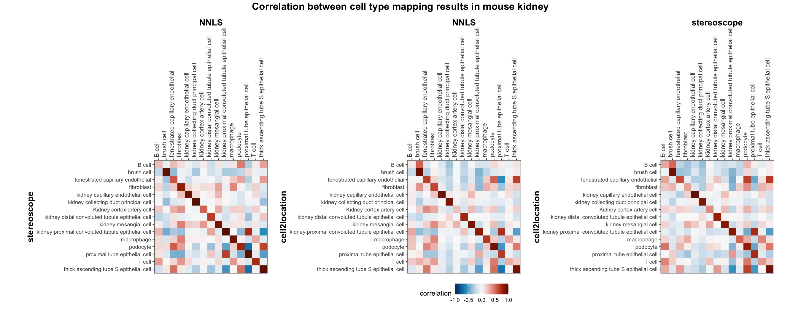

As described in the tutorial [Cell type mapping with NNLS](https://ludvigla.github.io/semla/articles/cell_type_mapping_with_NNLS.html), there is an implementation of a cell type mapping approach in `semla` based on the Non-Negative Least Squares (NNLS) method, as implemented in the [RcppML](https://github.com/zdebruine/RcppML) R package. Cell type mapping algorithms utilizes a well annotated scRNA-seq data set to learn cell type expression profiles in order to infer their relative abundance or proportions onto the spatial data. In short, the approach implemented in `semla` works by initially estimating enrichment scores for each available cell type in the scRNA-seq data and assigning weights to genes based on their cell type specificity. This information is in the following steps leveraged in the NNLS methods to solve the following optimization problem in order to assign cell type composition predictions to each spatial coordinate in the Visium data,

```{=latex}
\begin{equation}
\operatorname*{arg\:min_{x}} \left||Ax-y\right||_2^2 \text{, subject to } x \geq 0
\end{equation}
```
where *A* is a matrix with cell type enrichment scores, *y* is a vector with mixed a mixed gene expression profile. The solution for x represents estimates of the fractional abundances of cell type estimates.

<br>

To demonstrate the utility of this approach, we have performed a basic comparison with two other popular cell type mapping approaches, applied to two tissue types.

<br>

**Cell type mapping methods**

-   *NNLS*: Debruine, Zach & Melcher, Karsten & Triche, Timothy. (2021). Fast and robust non-negative matrix factorization for single-cell experiments. <https://doi.org/10.1101/2021.09.01.458620>

-   *Stereoscope*: Andersson, A., Bergenstråhle, J., Asp, M. *et al.* Single-cell and spatial transcriptomics enables probabilistic inference of cell type topography. *Commun Biol* **3**, 565 (2020). <https://doi.org/10.1038/s42003-020-01247-y>

-   *cell2location*: Kleshchevnikov, V., Shmatko, A., Dann, E. *et al.* Cell2location maps fine-grained cell types in spatial transcriptomics. *Nat Biotechnol* **40**, 661--671 (2022). <https://doi.org/10.1038/s41587-021-01139-4>

<br>

**Data sets**

-   Brain sagittal section (mouse).

    -   scRNA-seq: Allen Brain, mouse atlas reference single cell RNA-seq data set

    -   Visium: Mouse brain sagittal data (anterial + posterior) made available by [10x Genomics](https://www.10xgenomics.com/cn/resources/datasets/mouse-brain-serial-section-1-sagittal-anterior-1-standard-1-0-0), processed using the Space Ranger pipeline v1.0.0

-   Kidney (mouse)

    -   scRNA-seq: Tabula Muris Senis droplet data from kidney, made available by [The Tabula Muris Consortium](https://doi.org/10.1038%2Fs41586-020-2496-1)

    -   Visium: Mouse kidney coronal section data made available by [10x Genomics](https://www.10xgenomics.com/cn/resources/datasets/mouse-kidney-section-coronal-1-standard-1-1-0), processed using the Space Ranger pipeline v1.1.0

The same Visium and reference scRNA-seq data sets were used as input for all cell type deconvolution methods tested. The code displayed in the [Cell type mapping with NNLS](https://ludvigla.github.io/semla/articles/cell_type_mapping_with_NNLS.html) vignette was used to produce the NNLS mapping results, while *stereoscope* and *cell2location* were run in python on high-performance computing servers using default parameter settings.

<br>

```{r include=FALSE}
knitr::opts_chunk$set(
  echo=FALSE, message = FALSE, warning = FALSE
)
```

```{r message=FALSE, warning=FALSE}
library(semla)
library(tibble)
library(dplyr)
library(tidyr)
library(patchwork)
library(ggplot2)
```

```{r}
colors_c2l <- RColorBrewer::brewer.pal(8, "RdPu")
colors_ss <- RColorBrewer::brewer.pal(8, "GnBu")
colors_nnls <- viridis::rocket(8, direction = -1, begin = 0.3)
```

```{r include=FALSE}
se_brain_spatial <- readRDS("R_objects/se_brain_spatial")
se_kidney_spatial <- readRDS("R_objects/se_kidney_spatial")
```

```{r eval=FALSE}
se_brain_spatial <- readRDS("<path/to/se_brain_spatial>")
se_kidney_spatial <- readRDS("<path/to/se_kidney_spatial>")
```

```{r}
se_brain_spatial <- LoadImages(se_brain_spatial)
se_kidney_spatial <- LoadImages(se_kidney_spatial)
```

```{r eval=FALSE, include=FALSE}
# Replace with paths to local files
se_brain_spatial[["celltypeprops"]] <-
  readRDS(url(file.path("https://github.com/ludvigla/semla/blob/main/vignettes",
                        "comparison/mousebrain/celltypeprops?raw=true")))
se_brain_spatial[["stereoscope"]] <-
  readRDS(url(file.path("https://github.com/ludvigla/semla/blob/main/vignettes",
                        "comparison/mousebrain/stereoscope?raw=true")))
se_brain_spatial[["cell2location"]] <-
  readRDS(url(file.path("https://github.com/ludvigla/semla/blob/main/vignettes",
                        "comparison/mousebrain/cell2location?raw=true")))
```

```{r eval=FALSE, include=FALSE}
# Replace with paths to local files
se_kidney_spatial[["celltypeprops"]] <-
  readRDS(url(file.path("https://github.com/ludvigla/semla/blob/main/vignettes",
                        "comparison/mousekidney/celltypeprops?raw=true")))
se_kidney_spatial[["stereoscope"]] <-
  readRDS(url(file.path("https://github.com/ludvigla/semla/blob/main/vignettes",
                        "comparison/mousekidney/stereoscope?raw=true")))
se_kidney_spatial[["cell2location"]] <-
  readRDS(url(file.path("https://github.com/ludvigla/semla/blob/main/vignettes",
                        "comparison/mousekidney/cell2location?raw=true")))
```

```{r include=FALSE}
se_brain_spatial[["celltypeprops"]] <- readRDS(file = "../vignettes/comparison/mousebrain/celltypeprops")
se_brain_spatial[["stereoscope"]] <- readRDS(file = "../vignettes/comparison/mousebrain/stereoscope")
se_brain_spatial[["cell2location"]] <- readRDS(file = "../vignettes/comparison/mousebrain/cell2location")
```

```{r include=FALSE}
se_kidney_spatial[["celltypeprops"]] <- readRDS(file = "../vignettes/comparison/mousekidney/celltypeprops")
se_kidney_spatial[["stereoscope"]] <- readRDS(file = "../vignettes/comparison/mousekidney/stereoscope")
se_kidney_spatial[["cell2location"]] <- readRDS(file = "../vignettes/comparison/mousekidney/cell2location")
```

## Mouse brain

The results of each cell type mapping approach is stored as an *Assay* within the `semla` object, and the spot-wise Pearson correlation values are computed using the `cor()` function in R. The results are visualized as heatmaps using `ggplot2` and `geom_tile()`, where the fill color corresponds to the strength of the correlation.

```{r eval=FALSE, include=FALSE}
corMat <- cor(GetAssayData(se_brain_spatial, assay = "celltypeprops") |> as.matrix() |> t(), 
              GetAssayData(se_brain_spatial, assay = "stereoscope") |> as.matrix() |> t())
corMat <- corMat[intersect(rownames(corMat), colnames(corMat)), 
                 intersect(rownames(corMat), colnames(corMat))]
corMat_nnls_ss <- corMat
```

```{r eval=FALSE, include=FALSE}
corMat <- cor(GetAssayData(se_brain_spatial, assay = "celltypeprops") |> as.matrix() |> t(), 
              GetAssayData(se_brain_spatial, assay = "cell2location") |> as.matrix() |> t())
corMat <- corMat[intersect(rownames(corMat), colnames(corMat)), 
                 intersect(rownames(corMat), colnames(corMat))]
corMat_nnls_c2l <- corMat
```

```{r eval=FALSE, include=FALSE}
corMat <- cor(GetAssayData(se_brain_spatial, assay = "stereoscope") |> as.matrix() |> t(), 
              GetAssayData(se_brain_spatial, assay = "cell2location") |> as.matrix() |> t())
corMat <- corMat[intersect(rownames(corMat), colnames(corMat)), 
                 intersect(rownames(corMat), colnames(corMat))]
corMat_ss_c2l <- corMat
```

```{r eval=FALSE, include=FALSE, class.source = 'fold-hide'}
gg_nnls_ss <- corMat_nnls_ss |>
  data.frame(check.names = FALSE) |> 
  rownames_to_column(var = "NNLS") |> 
  as_tibble() |> 
  tidyr::pivot_longer(all_of(rownames(corMat_nnls_ss)), 
                      names_to = "stereoscope", 
                      values_to = "correlation")

gg_nnls_c2l <- corMat_nnls_c2l |>
  data.frame(check.names = FALSE) |> 
  rownames_to_column(var = "NNLS") |> 
  as_tibble() |> 
  tidyr::pivot_longer(all_of(rownames(corMat_nnls_c2l)), 
                      names_to = "cell2location", 
                      values_to = "correlation")

gg_ss_c2l <- corMat_ss_c2l |>
  data.frame(check.names = FALSE) |> 
  rownames_to_column(var = "stereoscope") |> 
  as_tibble() |> 
  tidyr::pivot_longer(all_of(rownames(corMat_ss_c2l)), 
                      names_to = "cell2location", 
                      values_to = "correlation")
```

```{r eval=FALSE, include=FALSE, fig.show='show', fig.width=13, fig.height=5.5, class.source = 'fold-hide'}
p1 <- ggplot(gg_nnls_ss, aes(NNLS, stereoscope, fill = correlation)) + geom_tile()
p2 <- ggplot(gg_nnls_c2l, aes(NNLS, cell2location, fill = correlation)) + geom_tile()
p3 <- ggplot(gg_ss_c2l, aes(stereoscope, cell2location, fill = correlation)) + geom_tile()

p_comp_brain <- (p1|p2|p3) + 
  plot_layout(guides = "collect") & 
  scale_fill_gradientn(colours = hcl.colors(11, "RdBu") |> rev(), limits = c(-1, 1)) &
  scale_y_discrete(limits = rev) &
  scale_x_discrete(position = "top") &
  theme_bw() &
  theme(aspect.ratio = 1, 
        axis.text.x = element_text(angle = 60, hjust = 0, size = 10),
        axis.title = element_text(face = "bold", size = 14), 
        legend.position = "bottom", plot.margin = margin(4,10,4,10))

jpeg(filename = "compare_cell_type_mapping_NNLS/mbrain_cor_heatmaps.jpg", width = 13*150, height = 5.5*150, res = 150)
p_comp_brain + patchwork::plot_annotation(title = "Correlation between cell type mapping results in mouse brain", 
                                          theme = theme(plot.title = element_text(hjust=0.5, size=16, face = "bold")))
dev.off()
```


<br>

In general, we can see that the correlation between mapped cell types values is high between the NNLS method and the other two tested approaches. As we do not have any ground truth values, it is unfortunately impossible for us to tell which of these methods produce results closest to the true cell type proportions in each spot.

We can also summarize the results by looking at the correlation between matching cell types, to better view if the NNLS method seems to share a higher concordance with a specific method for certain cell types.

```{r eval=FALSE, include=FALSE, fig.width=10, fig.height=4, class.source = 'fold-hide'}
gg_bar <- bind_rows(
  gg_nnls_ss |> filter(NNLS==stereoscope) |> mutate(cell_type = NNLS, comparison = "stereoscope") |> select(cell_type, comparison, correlation),
  gg_nnls_c2l |> filter(NNLS==cell2location) |> mutate(cell_type = NNLS, comparison = "cell2location") |> select(cell_type, comparison, correlation)
)
gg_bar$cell_type <- factor(gg_bar$cell_type, 
                           levels = gg_bar |> 
                             group_by(cell_type) |> summarise(max_cor = max(correlation)) |> 
                             arrange(desc(max_cor)) |> select(cell_type) |> unlist() |> as.character())

p_bars <- ggplot(gg_bar, aes(x = cell_type, y = correlation, fill = comparison)) +
  geom_bar(stat = "identity", position = 'dodge', colour="grey30", linewidth = 0.25, width = 0.7) +
  geom_hline(yintercept = 0, colour="grey30", linewidth = 0.25) +
  labs(fill = "Method compared against NNLS: ") +
  ylim(0,1) +
  scale_fill_manual(values = c(colors_c2l[5], colors_ss[7])) +
  theme_light() +
  theme(panel.grid.minor.y = element_blank(), 
        axis.title.x = element_blank(),
        axis.text.x = element_text(angle = 45, hjust = 1, size = 10),
        legend.position = "top")

jpeg(filename = "compare_cell_type_mapping_NNLS/mbrain_cor_bars.jpg", width = 10*150, height = 4*150, res = 150)
p_bars
dev.off()
```


<br>

Here, we can for instance more easily spot a large difference in the correlation values between the NNLS:stereoscope an NNLS:cell2location for Pvalb cells, demonstrating an example of how different cell type mapping algorithms can perform drastically different despite the same input.

Lastly, let us have a look at the cell type mapping results from all three approaches spatially.

```{r fig.show='show'}
brain_selected_cells <- 
  intersect(
    intersect(rownames(se_brain_spatial[["celltypeprops"]]),
              rownames(se_brain_spatial[["stereoscope"]])),
    rownames(se_brain_spatial[["cell2location"]])
  )
```

```{r eval=FALSE, include=FALSE, class.source = 'fold-hide'}
plots_comp <- lapply(seq_along(brain_selected_cells), function(i) {
    DefaultAssay(se_brain_spatial) <- "celltypeprops"
    p1 <- MapFeatures(se_brain_spatial,
                features = brain_selected_cells[i], 
                colors = colors_nnls,
                override_plot_dims = T) & 
      labs(fill = "NNLS") &
      theme(plot.subtitle = element_blank(), 
            plot.title = element_blank())
    p1 <- p1 + 
      # plot_layout(guides = "collect") & 
      theme(legend.position = "top")
    
    DefaultAssay(se_brain_spatial) <- "stereoscope"
    p2 <- MapFeatures(se_brain_spatial, 
                features = brain_selected_cells[i], 
                colors = colors_ss,
                override_plot_dims = T) & 
      labs(fill = "Stereoscope") &
      theme(plot.subtitle = element_blank(), 
            plot.title = element_blank())
    p2 <- p2 + 
      # plot_layout(guides = "collect") & 
      theme(legend.position = "top")
    
    DefaultAssay(se_brain_spatial) <- "cell2location"
    p3 <- MapFeatures(se_brain_spatial, 
                features = brain_selected_cells[i], 
                colors = colors_c2l,
                override_plot_dims = T) & 
      labs(fill = "Cell2location") & 
      theme(plot.subtitle = element_blank(), 
            plot.title = element_blank())
    p3 <- p3 + 
      # plot_layout(guides = "collect") & 
      theme(legend.position = "top")
    
    (p1 | p2 | p3) & patchwork::plot_annotation(title = brain_selected_cells[i], 
                                    theme = theme(plot.title = element_text(hjust=0.5, face = "bold")))
}) |> setNames(nm = brain_selected_cells)
```

```{r eval=FALSE, include=FALSE}
saveRDS(plots_comp, "compare_cell_type_mapping_NNLS/mbrain_spatial_map_plots.rds")
```

```{r include=FALSE}
plots_comp <- readRDS("compare_cell_type_mapping_NNLS/mbrain_spatial_map_plots.rds")
```

### Spatial cell type mapping {.tabset}

```{r results='asis', echo=FALSE, fig.show='show', fig.width=13, fig.height=3.5}
for(i in seq_along(brain_selected_cells)){
  cat("#### ", brain_selected_cells[i], "\n")
  cat("\n")
  print(plots_comp[[i]])
  cat("\n\n")
}
```

## Mouse kidney

The same comparison approach as for the mouse brain data is applied to study the results for the mouse kidney sample, producing spot-wise correlation values between the cell type mapping results using the three different methods included for the comparison.

```{r eval=FALSE, include=FALSE}
corMat <- cor(GetAssayData(se_kidney_spatial, assay = "celltypeprops") |> as.matrix() |> t(), 
              GetAssayData(se_kidney_spatial, assay = "stereoscope") |> as.matrix() |> t())
corMat <- corMat[intersect(rownames(corMat), colnames(corMat)), 
                 intersect(rownames(corMat), colnames(corMat))]
kdn_corMat_nnls_ss <- corMat
```

```{r eval=FALSE, include=FALSE}
corMat <- cor(GetAssayData(se_kidney_spatial, assay = "celltypeprops") |> as.matrix() |> t(), 
              GetAssayData(se_kidney_spatial, assay = "cell2location") |> as.matrix() |> t())
corMat <- corMat[intersect(rownames(corMat), colnames(corMat)), 
                 intersect(rownames(corMat), colnames(corMat))]
kdn_corMat_nnls_c2l <- corMat
```

```{r eval=FALSE, include=FALSE}
corMat <- cor(GetAssayData(se_kidney_spatial, assay = "stereoscope") |> as.matrix() |> t(), 
              GetAssayData(se_kidney_spatial, assay = "cell2location") |> as.matrix() |> t())
corMat <- corMat[intersect(rownames(corMat), colnames(corMat)), 
                 intersect(rownames(corMat), colnames(corMat))]
kdn_corMat_ss_c2l <- corMat
```

```{r eval=FALSE, include=FALSE, class.source = 'fold-hide'}
kdn_gg_nnls_ss <- kdn_corMat_nnls_ss |>
  data.frame(check.names = FALSE) |> 
  rownames_to_column(var = "NNLS") |> 
  as_tibble() |> 
  tidyr::pivot_longer(all_of(rownames(kdn_corMat_nnls_ss)), 
                      names_to = "stereoscope", 
                      values_to = "correlation")

kdn_gg_nnls_c2l <- kdn_corMat_nnls_c2l |>
  data.frame(check.names = FALSE) |> 
  rownames_to_column(var = "NNLS") |> 
  as_tibble() |> 
  tidyr::pivot_longer(all_of(rownames(kdn_corMat_nnls_c2l)), 
                      names_to = "cell2location", 
                      values_to = "correlation")

kdn_gg_ss_c2l <- kdn_corMat_ss_c2l |>
  data.frame(check.names = FALSE) |> 
  rownames_to_column(var = "stereoscope") |> 
  as_tibble() |> 
  tidyr::pivot_longer(all_of(rownames(kdn_corMat_ss_c2l)), 
                      names_to = "cell2location", 
                      values_to = "correlation")
```

```{r eval=FALSE, include=FALSE, fig.show='show', fig.width=18, fig.height=7, class.source = 'fold-hide'}
p1 <- ggplot(kdn_gg_nnls_ss, aes(NNLS, stereoscope, fill = correlation)) + geom_tile()
p2 <- ggplot(kdn_gg_nnls_c2l, aes(NNLS, cell2location, fill = correlation)) + geom_tile()
p3 <- ggplot(kdn_gg_ss_c2l, aes(stereoscope, cell2location, fill = correlation)) + geom_tile()

p_comp_kidney <- (p1|p2|p3) + 
  plot_layout(guides = "collect") & 
  scale_fill_gradientn(colours = hcl.colors(11, "RdBu") |> rev(), limits = c(-1, 1)) &
  scale_y_discrete(limits = rev) &
  scale_x_discrete(position = "top") &
  theme_bw() &
  theme(aspect.ratio = 1, 
        axis.text.x = element_text(angle = 90, hjust = 0, size = 10),
        axis.title = element_text(face = "bold", size = 14), 
        legend.position = "bottom", plot.margin = margin(4,10,4,10))

jpeg(filename = "compare_cell_type_mapping_NNLS/mkidney_cor_heatmaps.jpg", width = 18*150, height = 7*150, res = 150)
p_comp_kidney + patchwork::plot_annotation(title = "Correlation between cell type mapping results in mouse kidney", 
                                          theme = theme(plot.title = element_text(hjust=0.5, size=16, face = "bold")))
dev.off()
```



```{r eval=FALSE, include=FALSE, fig.width=8, fig.height=5.5, class.source = 'fold-hide'}
gg_bar <- bind_rows(
  kdn_gg_nnls_ss |> filter(NNLS==stereoscope) |> mutate(cell_type = NNLS, comparison = "stereoscope") |> select(cell_type, comparison, correlation),
  kdn_gg_nnls_c2l |> filter(NNLS==cell2location) |> mutate(cell_type = NNLS, comparison = "cell2location") |> select(cell_type, comparison, correlation)
)
gg_bar$cell_type <- factor(gg_bar$cell_type, 
                           levels = gg_bar |> 
                             group_by(cell_type) |> summarise(max_cor = max(correlation)) |> 
                             arrange(desc(max_cor)) |> select(cell_type) |> unlist() |> as.character())

p_bars_kidney <- ggplot(gg_bar, aes(x = cell_type, y = correlation, fill = comparison)) +
  geom_bar(stat = "identity", position = 'dodge', colour="grey30", linewidth = 0.25, width = 0.7) +
  geom_hline(yintercept = 0, colour="grey30", linewidth = 0.25) +
  labs(fill = "Method compared against NNLS: ") +
  ylim(0,1) +
  scale_fill_manual(values = c(colors_c2l[5], colors_ss[7])) +
  theme_light() +
  theme(panel.grid.minor.y = element_blank(), 
        axis.title.x = element_blank(),
        axis.text.x = element_text(angle = 90, hjust = 1, size = 10),
        legend.position = "top")

jpeg(filename = "compare_cell_type_mapping_NNLS/mkidney_cor_bars.jpg", width = 8*150, height = 5.5*150, res = 150)
p_bars_kidney
dev.off()
```


Also for this data set, there is an overall high cell-cell correlation between the NNLS results and those produced by stereoscope and cell2location. However, we can for instance see that all three methods seem to have difficulties correctly mapping B cells, as there seem to be very little concordance across the method mapping results.

```{r}
kidney_selected_cells <- 
  intersect(
    intersect(rownames(se_kidney_spatial[["celltypeprops"]]),
              rownames(se_kidney_spatial[["stereoscope"]])),
    rownames(se_kidney_spatial[["cell2location"]])
  )
```

```{r eval=FALSE, include=FALSE, class.source = 'fold-hide'}
kdn_plots_comp <- lapply(seq_along(kidney_selected_cells), function(i) {
    DefaultAssay(se_kidney_spatial) <- "celltypeprops"
    p1 <- MapFeatures(se_kidney_spatial, 
                features = kidney_selected_cells[i], 
                colors = colors_nnls,
                override_plot_dims = T) & 
      labs(title = "NNLS") & 
      theme(plot.subtitle = element_blank(), 
            plot.title = element_text(size=12));p1
    
    DefaultAssay(se_kidney_spatial) <- "stereoscope"
    p2 <- MapFeatures(se_kidney_spatial, 
                features = kidney_selected_cells[i], 
                colors = colors_ss,
                override_plot_dims = T) & 
      labs(title = "Stereoscope") & 
      theme(plot.subtitle = element_blank(), 
            plot.title = element_text(size=12))
    
    DefaultAssay(se_kidney_spatial) <- "cell2location"
    p3 <- MapFeatures(se_kidney_spatial, 
                features = kidney_selected_cells[i], 
                colors = colors_c2l,
                override_plot_dims = T) & 
      labs(title = "Cell2location") & 
      theme(plot.subtitle = element_blank(), 
            plot.title = element_text(size=12))
    
    (p1 | p2 | p3) & patchwork::plot_annotation(title=stringr::str_to_title(kidney_selected_cells[i]), 
                                    theme = theme(plot.title = element_text(hjust=0.5, face = "bold")))
}) |> setNames(nm = kidney_selected_cells)
```

```{r eval=FALSE, include=FALSE}
saveRDS(kdn_plots_comp, "compare_cell_type_mapping_NNLS/mkidney_spatial_map_plots.rds")
```

```{r include=FALSE}
kdn_plots_comp <- readRDS("compare_cell_type_mapping_NNLS/mkidney_spatial_map_plots.rds")
```

### Spatial cell type mapping {.tabset}

```{r results='asis', echo=FALSE, fig.show='show', fig.width=7, fig.height=3.5}
for(i in seq_along(kidney_selected_cells)){
  cat("#### ", stringr::str_to_title(kidney_selected_cells[i]), "\n")
  cat("\n")
  print(kdn_plots_comp[[i]])
  cat("\n\n")
}
```

## Conclusion

In summary, we here demonstrate the utility of the NNLS approach for cell type decomposition of Visium data, using two separate data sets, by comparing it with two well established methods, *stereoscope* and *cell2location*. Overall, the concordance in the inferred cell type spot proportion is high between all methods, showing that NNLS is an acceptable alternative for performing a fast cell type mapping analysis of your Visium data, where a good reference scRNA-seq data set is available. We would still recommend users to try out additional methods on their data in order to fully appreciate the variability in the mapping results that may occur due to design differences of these algorithms. Nonetheless, the NNLS approach provided in `semla` can act as an initial test ground for optimizing cell type annotation levels or filtering parameters in a quick and versatile fashion, before moving on to a slightly more computationally heavy approach.

<br>

------------------------------------------------------------------------

<details open>

<summary>**Package versions**</summary>

-   `semla`: `r packageVersion("semla")`

</details>

<details>

<summary>**Session info**</summary>

```{r}
sessionInfo()
```

</details>

<br>
