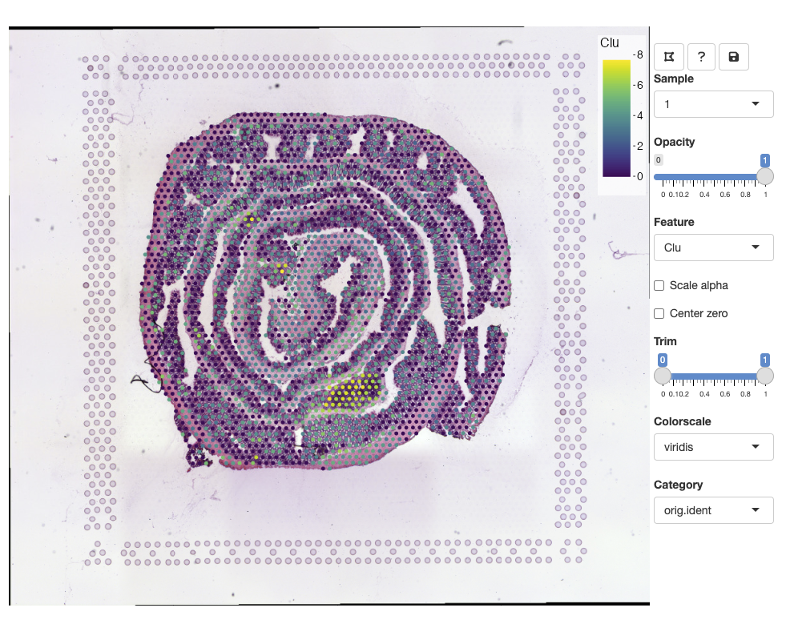
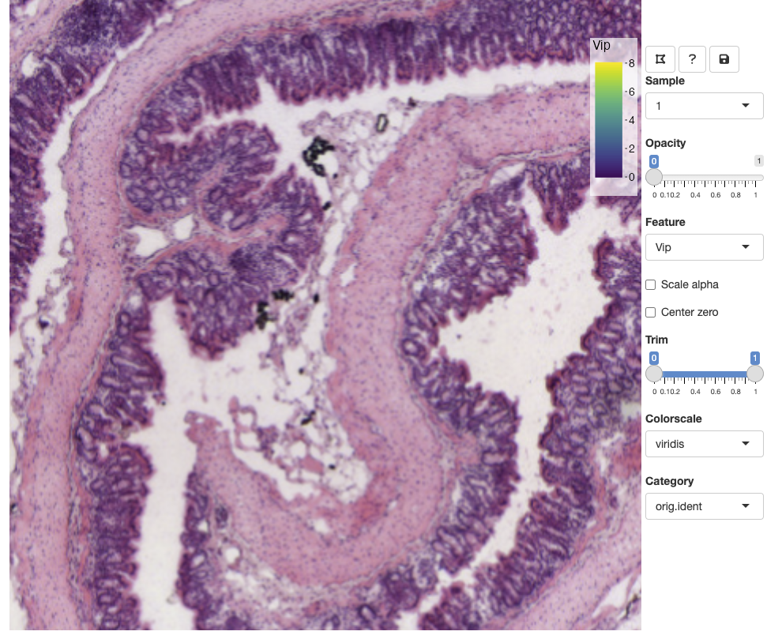
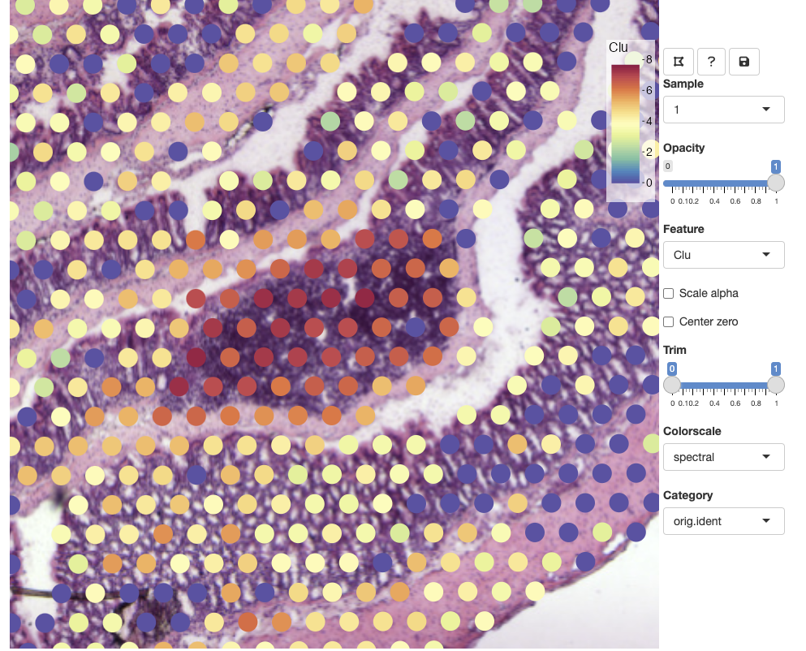

`semla`'s Feature Viewer is an interactive application that can be run directly from R which makes it possible to interactively visualize features present in a `Seurat` object and it also makes it possible to manually annotate spots.

Some of the functionality is similar to what you can do with the [Loupe Browser](https://www.10xgenomics.com/products/loupe-browser) or the [ST viewer](https://pubmed.ncbi.nlm.nih.gov/30875427/) but if you are using `Seurat` (or any other R package) for your analyses, it can be cumbersome to import/export results back and forth from R.

Having the option to interactively explore an SRT data set can be very useful. For example, a common task is to manually annotate spots based on morphological features of an H&E image which can only be done through an interactive application. Moreover, when we map gene expression to our H&E images in R, it is often difficult to associate their patterns with small morphological structures. At a quick glance, the expression of marker genes associated with small structures might appear random in plots, and it is only when we zoom in at the H&E image that we can see the tissues and cells that they are associated with.

```{r message=FALSE, warning=FALSE}
library(semla)
```

## Feature viewer

Using our mouse brain data set as an example, we'll go through how to use the `FeatureViewer()` application.

```{r fig.asp=1}
se <- readRDS(system.file("extdata/mousecolon", "se_mcolon", package = "semla")) |> 
  LoadImages()
ImagePlot(se)
```

### Data export

To initiate the viewer, we call the `FeatureViewer()` function with our `Seurat` object as input. `FeatureViewer()` will automatically attempt to export all necessary files to a temporary directory (default) or a specified directory (`datadir`). These files include tiled H&E images, spot coordinates and an additional meta data file with image related information. If you are working with a larger data set with multiple tissue sections, you probably want to avoid exporting these files each time you open the viewer. You can find more instruction further down in this tutorial under [Advanced](#adv).

### Running the interactive viewer

When the app is closed, any changes made in the app will be returned to our `Seurat` object, so we need to call `se <- FeatureViewer(se)` to save changes to our `Seurat` object. It is important to note that the application should be exited by clicking on the '**save**' icon in the top right corner of the app, otherwise any changes that we've made will not be returned to R.

NB: Like most functions provided in `semla`, `FeatureViewer()` only works with `Seurat` objects processed with `semla`.

```{r eval=FALSE}
se <- FeatureViewer(se)
```

The app should open in your default browser:



<br>

To get started, you can click on the '**question mark**' icon which will give instructions on how to use the app:


### Zoom and pan

You can zoom in and out using the mouse wheel and pan by dragging clicking and dragging the H&E image. The opacity slider allows us to hide spots if we wish to view clear the view of the H&E image:



### Selecting features

From the Feature drop down list, we can select any numeric feature available in our `Seurat` object. This includes vectors stored in the `meta.data` slot as well as dimensionality reduction vectors stored in the `reductions` slot. If you have multiple assays available in your `Seurat` object, only features from the active assay will be available. This is to avoid naming conflicts as different assays can share identical feature IDs. If you want to select raw or scaled counts, you can specify what `Assay` slot to use with the `slot` argument in `FeatureViewer`.



### Other options

-   **opacity slider**: scale spot opacity.

-   **scale alpha**: scale the spot opacity of numeric features based on feature values.

-   **Trim slider**: trim lower and upper bounds of the selected numeric feature values. 0 corresponds to the minimum value and 1 corresponds to the maximum value.

-   **Colorscale**: select a color palette for numeric features.

-   **center zero**: centers the color scale at 0 which can be useful when visualizing centered values, for example principal component vectors or scaled expression. If center zero is active, it is appropriate to use a divergent color palette from 'Colorscales', such as `RdBu`.

### Category

Categorical variables stored in the `Seurat` object `meta.data` slot are made available through the 'Category' drop-down list. You can select a new category or select the current category and press `ENTER` to update the view.


### Lasso tool

In the example above, we selected the `meta.data` column called `orig.ident` which currently only contains one label. When a categorical variable is selected, we get the option to add new labels. Before we can add a new label, we need to select spots with the '**lasso tool**' in the top left corner of the toolbar:


Select a color from the color picker, write a new label name and press `ENTER` to save the changes:


Once a new label has been added, it should pop up in the color legend.

Labels can share the same color, but if you wish to update the color of an existing label, you can select spots from the same selection, select a new color, write the same label name and press `ENTER`. This will update the color for all spots with that label.

NB: The lasso tool will freeze the current view, meaning that you will not be able to zoom and pan while the lasso tool is active. Deactivate the lasso tool to enable navigation in the viewer.

### Add new categories

To add a new category, you simply click on the 'Category' drop-down box, delete the text, write a new category name and press `ENTER`

### Save changes

To continue working in R you will need to quit the application by pressing the '**save & quit**' icon in the top right corner of the toolbar.

## Advanced {#adv}

### Export data

You export all necessary data for the viewer to a specific output directory with the `ExportDataForViewer()` function. This can come in handy when you are working with larger datasets and you don't want re-export data every time you run the viewer. The output directory is specified with the `outdir` argument which needs to be an existing writable directory. If the files already exist in this location, you will need to set `overwrite=TRUE` if you want to overwrite the files.

`ExportDataForViewer()` creates a new directory inside `outdir` called 'viewer_data', so the full path will be <OUTDIR>/viewer_data. This path is returned by the function to be passed to `FeatureViewer`. You can also specify what samples to export data for with the `sampleIDs` argument. For example, if you chose to export one section 1 (sampleIDs=1), you will only be able to view this section with `FeatureViewer`.

```{r eval=FALSE}
datapath <- ExportDataForViewer(se, sampleIDs = 1, outdir = "~/Downloads/")
```

Now we can pass `datadir = datapath` to `FeatureViewer` and it will load files from that directory instead of exporting the files again.

```{r eval=FALSE}
se <- FeatureViewer(se, datadir = datapath)
```

### Multiple sections

When using multiple datasets, you will be able to select them from the `Sample` drop-down list in the viewer. Note that when working with many datasets, the app might slow down considerably. In this case, it might be better to view only a few selected sections specified with `sampleIDs`.

```{r eval=FALSE}
se_mbrain <- readRDS(system.file("extdata/mousebrain", "se_mbrain", package = "semla"))
se_mcolon <- readRDS(system.file("extdata/mousecolon", "se_mcolon", package = "semla"))
se_merged <- MergeSTData(se_mbrain, se_mcolon) |> LoadImages()
se_merged <- FeatureViewer(se_merged)
```

### Feature Viewer and docker

The viewer uses image tiles to create interactive maps of tissues which are accessed from a static file server hosted locally. By default, the server is hosted on `127.0.0.1:8080` and the viewer can fetch the image tiles directly from this address. When using RStudio Server via docker, we need to make sure that the port we are using (inside the container) is exposed outside the container, otherwise the tiles will not be accessible to the viewer which will be blank.

In the `docker run ...` command used to start the container, we set `-p 3030:3030` to expose port 3030 inside the container to port 3030 outside the container. Now we should be able to run the `Feature Viewer` with:

```         
FeatureViewer(..., host = "0.0.0.0", port = 3030)
```

<br>

------------------------------------------------------------------------

<details open>

<summary>**Package version**</summary>

-   `semla`: `r packageVersion("semla")`

</details>

<br>
