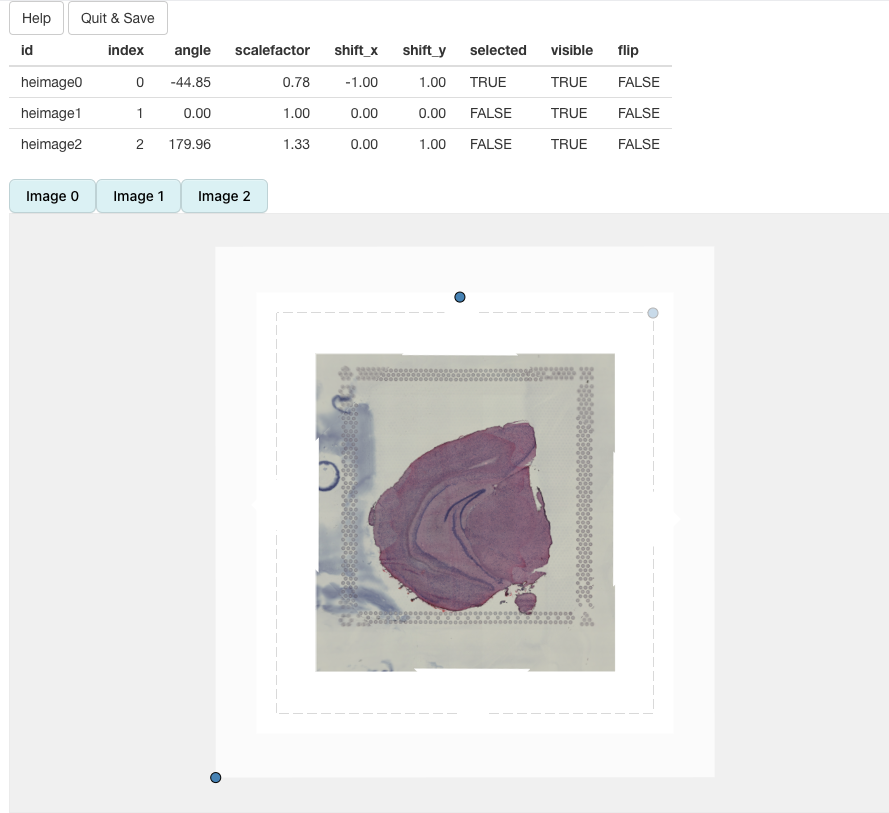
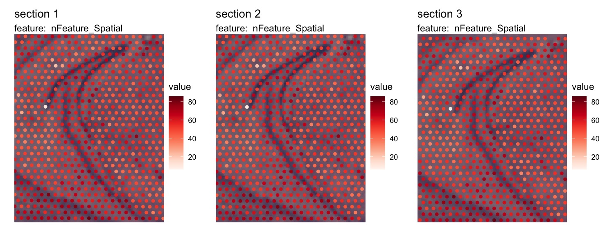

In this tutorial, we will look at two ways of transforming the H&E images in a 10x Visium dataset. The is typically useful if you want to align similar tissue sections to make it easier to compare results between them.

The alignment functions in `semla` only handles rigid transformations, meaning that non-linear distortions are not possible to mitigate. If rigid transformations are sufficient to generate a decent alignment, one could for example use the aligned coordinates for 3D visualization. However, we do not provide visualization functions for 3D in `semla`.

```{r message=FALSE, warning=FALSE}
library(semla)
```

```{r message=FALSE}
se_mbrain <- readRDS(file = system.file("extdata", 
                                        "mousebrain/se_mbrain", 
                                        package = "semla"))
se_mbrain <- LoadImages(se_mbrain)
```

```{r fig.asp=1}
ImagePlot(se_mbrain)
```

`semla` offers two ways of manipulating the orientation and position of H&E images using rigid transformations. Allowed transformations are:

-   **translation** =\> move H&E image along x- and/or y-axis
-   **rotation** =\> rotate image by a fixed degree
-   **mirror** =\> mirror H&E image along x- and/or y-axis

Transformations can be applied to the H&E images programatically or interactively:

-   `RigidTranformImages()`: if you know what transformations to apply
-   `RunAlignment()`: opens an interactive viewer where you can manipulate the H&E images

## Basic image transformation

The first step is to generate a tibble with the transformations that you want to apply. `generate_rigid_transform()` is a helper function that makes this task a bit easier.

In the example below, we'll mirror the H&E image along the x axis, rotate it by 30 degrees, move it 20% to the right and 20% up. Translations (`tr_x` and `tr_y`) are provided as proportions. For example, `tr_x = 0.1` means that you'll move the H&E image 20% of the image width to the right.

```{r}
transforms <- generate_rigid_transform(mirror_x = TRUE, angle = 30, tr_x = 0.2, tr_y = -0.2)
transforms
```

Now we are ready to apply the transformations:

```{r message=FALSE}
se_mbrain <- RigidTransformImages(se_mbrain, transforms = transforms)
```

The original H&E image is still stored in the `Seurat` object, so when plotting we need to specify that we want to use the transformed image:

```{r fig.asp=1}
ImagePlot(se_mbrain)
title("Original H&E image")
ImagePlot(se_mbrain, image_use = "transformed")
title("Transformed H&E image")
```

The spot coordinates are transformed together with the H&E image, so if we use `MapFeatures()` or `MapLabels()`, we should see that the spots are still correctly positioned on the H&E image.

NB: Translations might result in moving parts of the H&E image outside of the predefined 'canvas'. In our example below, this results in some spots being located outside of the view and these will therefore be dropped. The original image dimensions are always retained.

```{r fig.asp=1}
MapFeatures(se_mbrain, features = "nFeature_Spatial", image_use = "transformed")
```

## Interactive alignment

Here we will take a look at three H&E images with different orientations, and the goal is to align them to a common coordinate system.

You can click on 'show' to see the code used to generate this dummy data using `RigidTransformImages`.

<details>

<summary>show</summary>

```{r message=FALSE}
se_merged <- MergeSTData(se_mbrain, list(se_mbrain, se_mbrain)) |> LoadImages()
transforms1 <- generate_rigid_transform(mirror_x = TRUE, angle = 45, sampleID = 1)
transforms2 <- generate_rigid_transform(mirror_x = TRUE, scalefactor = 0.8, sampleID = 2)
transforms3 <- generate_rigid_transform(mirror_y = TRUE, scalefactor = 0.6, sampleID = 3)
transforms <- bind_rows(transforms1, transforms2, transforms3)
se_merged <- RigidTransformImages(se_merged, transforms = transforms, verbose = TRUE)
se_merged@tools$Staffli@rasterlists$raw <- se_merged@tools$Staffli@rasterlists$transformed
se_merged@tools$Staffli@rasterlists$transformed <- NULL
se_merged@tools$Staffli@meta_data <- se_merged@tools$Staffli@meta_data |> 
  select(-pxl_col_in_fullres, -pxl_row_in_fullres) |> 
  rename(pxl_col_in_fullres = pxl_col_in_fullres_transformed, pxl_row_in_fullres = pxl_row_in_fullres_transformed)
```

</details>

```{r fig.asp=0.4}
ImagePlot(se_merged, mar = c(0, 0, 0, 0), ncol = 3)
```

```{r eval=FALSE}
se_merged <- RunAlignment(se_merged)
```

When we call `RunAlignment`, an interactive application will open up in a separate window.


If you click on `Help`, you will see instructions on how to use the app:


We can select what H&E images should be put into view by clicking on the button above the alignment panel:


H&E images can be moved around by dragging the image with the cursor. The dotted borders around the H&E images highlights the dimensions of the 'canvas'. Anything outside of these borders will be removed.

Some of the interaction is handled by pressing a key and clicking on an H&E image. For example, you can change the transparency by holding `q` or `w` and clicking on an H&E image.

We can rotate an H&E image by holding `SHIFT` and dragging the blue dot in the corner of the image. Similarly, scaling can be done by holding and dragging the blue dot.

In the example below, we can see that 'image2' has been scaled and rotated to align with 'image1'. All that is left is align 'image2' with 'image1':


In the end, we should be able to get a decent alignment of the three H&E images. The table on top of the alignment panel shows the transformations that have been applied:



Once we are satisfied with the alignment, we can press the `Quit & Save` button which will trigger the alignment of our H&E images (in R) and the results will be saved to our `Seurat` object.

If we set `image_use='transformed'` in `MapFeatures`, we will see that the the H&E images are now aligned.

NB: Manipulating the images will often lead to some cropping. In the first image below, we can see that the corners are cropped and filled with empty white space.

```{r eval=FALSE}
MapFeatures(se_merged, features = "nFeature_Spatial", image_use = "transformed", ncol = 3) &
  theme(legend.position = "right", legend.text = element_text(angle = 0))
```


Now that the data is aligned, it will be easier to look at specific areas of the tissue sections with the `crop_area` option

```{r eval=FALSE}
se_merged <- LoadImages(se_merged, image_height = 1.5e3)
MapFeatures(se_merged, features = "nFeature_Spatial", image_use = "transformed", 
            ncol = 3, crop_area = c(0.4, 0.43, 0.6, 0.67)) &
  theme(legend.position = "right", legend.text = element_text(angle = 0))
```



## Images with different dimensions

`RunAlignment` applies the transformations to each image independently and makes sure that the original dimensions of the images are kept. This behavior might seem confusing at first. Let's say that you want to force all images to align with the first H&E image so that you can use the transformed coordinates for 3D visualization, this will not work without some additional processing. 

In the example below, we can see two H&E images with slightly different dimensions. The second image (mouse colon tissue) has an aspect ration lower than 1 whereas the first image (mouse brain tissue) has an aspect ratio higher than 1 but both images are loaded with the same height. When applying transformations to the second image, the dashed box will only define where the image will be placed relative to the first image, but the image will keep its aspect ratio.

```{r eval=FALSE}
se_mbrain <- readRDS(file = system.file("extdata", 
                                        "mousebrain/se_mbrain", 
                                        package = "semla"))
se_mcolon <- readRDS(file = system.file("extdata", 
                                        "mousecolon/se_mcolon", 
                                        package = "semla"))
se_merged <- MergeSTData(se_mbrain, se_mcolon) |> LoadImages()

se_merged <- RunAlignment(se_merged)
```


If we apply rigid transformations according to the image above, the result will be this:

```{r eval=FALSE}
ImagePlot(se_merged, image_use = "transformed")
```


Here you can see that the second image fits the top and bottom of the dashed box, but the sides are wider than the box.

## 3D visualization

3D visualization requires some additional processing. For each tissue section, the spot coordinates can be defined on completely different scales. In order to place the coordinates on the same scale, we can adjust the coordinates by dividing them with the width/height of the H&E images.

The code below can be used to scale the transformed coordinates to a common coordinate system, in this case they will range from 0 to 1. We can use the `sampleID` as a z-coordinate to create a "z-stack" that can be visualized in 3D. We'll leave the actual 3D visualization as an exercise, but to achieve this you can for example use the R package [plotly](https://plotly.com/r/).

```{r eval=FALSE}
xy_coords <- GetStaffli(se_merged)@meta_data |> 
  select(pxl_col_in_fullres_transformed, pxl_row_in_fullres_transformed, sampleID) |> 
  group_by(sampleID) |> 
  group_split()
  
image_info <- GetStaffli(se_merged)@image_info

# Adjust coordinates
adjusted_coords <- do.call(bind_rows, lapply(seq_along(xy_coords), function(i) {
  xy <- xy_coords[[i]]
  full_width <- image_info[i, ]$full_width
  full_height <- image_info[i, ]$full_height
  xy <- xy |> 
    mutate(x = pxl_col_in_fullres_transformed/full_width,
           y = pxl_row_in_fullres_transformed/full_height) |> 
    select(x, y, sampleID)
}))

```


<br>

------------------------------------------------------------------------

<details open>

<summary>**Package version**</summary>

-   `semla`: `r packageVersion("semla")`

</details>

<details>

<summary>**Session info**</summary>

```{r}
sessionInfo()
```

</details>

<br>
